# Documentación API


## Estructura de carpetas
- `src/main/java/com/example/cervezas/` - código fuente Java (controllers, services, entities, dto, mapper, repository, exception)
- `src/main/resources/` - recursos de Spring Boot (`application.properties`, `data.sql`)
- `initSQL/` - scripts SQL para inicializar la base de datos (tables + data)
- `pom.xml` - dependencias y configuración de Maven
- `docker-compose.yml` - configuración opcional de contenedores (MariaDB, Adminer)
- `resultados-endpoints.md` / `Documentacion-API.md` - documentación y ejemplos de uso

## Cómo utilizar la API
Para poder utilizarla puedes usar curl o una herramienta como Insomnia/Postman: elegir el método HTTP correspondiente, añadir la ruta del endpoint (url base: `http://localhost:8080`)y enviar el cuerpo en formato JSON cuando proceda. Abajo hay ejemplos de uso realizados en Insomnia.


## Ejemplos de las consultas

Ejemplos para cada controlador y cada endpoint.

### BeerController

**GET localhost:8080/beers**: Se obtienen todas las cervezas
- Estado esperado: 200 (OK)
- Resultado: Array JSON con todas las cervezas de la base de datos
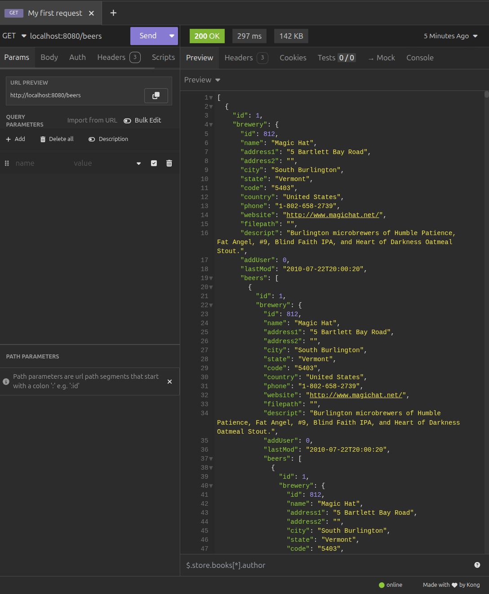 

**POST localhost:8080/beer**: Crea una nueva cerveza
- Cuerpo de ejemplo: 
```json
{
  "breweryId": 1,
  "name": "name1",
  "categoryId": 1,
  "styleId": 1,
  "abv": 5.0,
  "ibu": 20.0,
  "srm": 10.0,
  "upc": 123456,
  "filepath": "filepath1",
  "descript": "descript1",
  "addUser": 1
}
```
- Estado esperado: 201 (CREATED)
- Resultado: Objeto JSON de la cerveza creada con su ID asignado
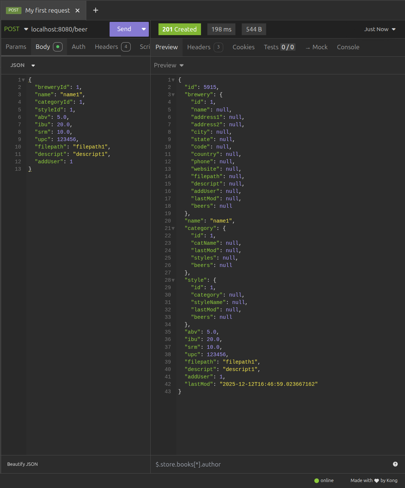

**GET localhost:8080/beer/{id}**: Obtiene una cerveza por su ID
- Estado esperado: 200 (OK)
- Resultado: Objeto JSON con los datos de la cerveza solicitada
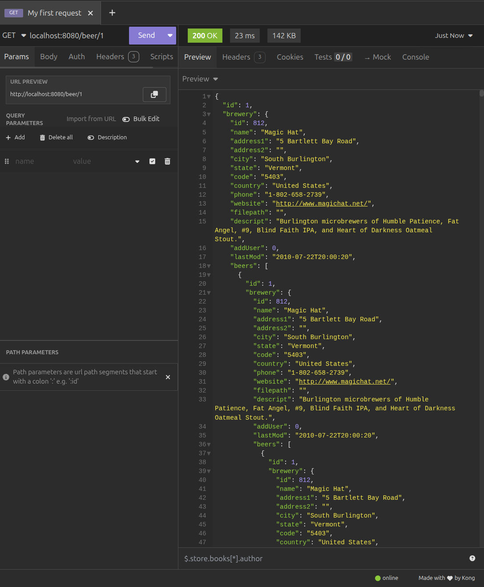

**PUT localhost:8080/beer/{id}**: Actualiza una cerveza existente
- Cuerpo de ejemplo (actualización completa): 
```json
{
  "breweryId": 1,
  "name": "name1",
  "categoryId": 1,
  "styleId": 1,
  "abv": 5.0,
  "ibu": 20.0,
  "srm": 10.0,
  "upc": 123456,
  "filepath": "filepath1",
  "descript": "descript1",
  "addUser": 1
}
```

- Cuerpo de ejemplo (actualización parcial): 
```json
{
  "name": "name2",
  "abv": 6.5
}
```

- Estado esperado: 200 (OK)
- Resultado: Objeto JSON con los datos actualizados de la cerveza
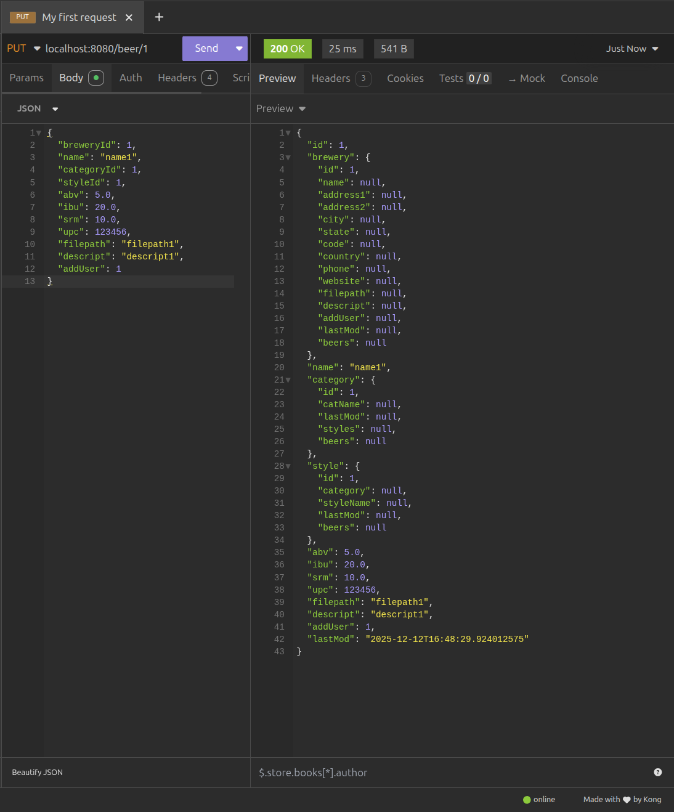

**DELETE localhost:8080/beer/{id}**: Elimina una cerveza por su ID
- Estado esperado: 204 (NO CONTENT)
- Resultado: Sin contenido en el body
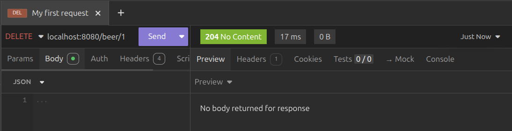

### BreweryController

**GET localhost:8080/breweries**: Se obtienen todas las cervecerías
- Estado esperado: 200 (OK)
- Resultado: Array JSON con todas las cervecerías de la base de datos
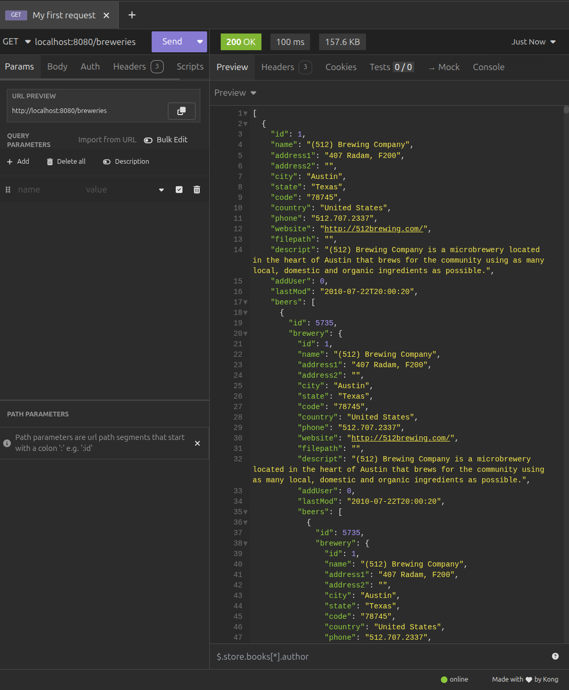

**GET localhost:8080/brewerie/{id}**: Obtiene una cervecería por su ID
- Estado esperado: 200 (OK)
- Resultado: Objeto JSON con los datos de la cervecería solicitada
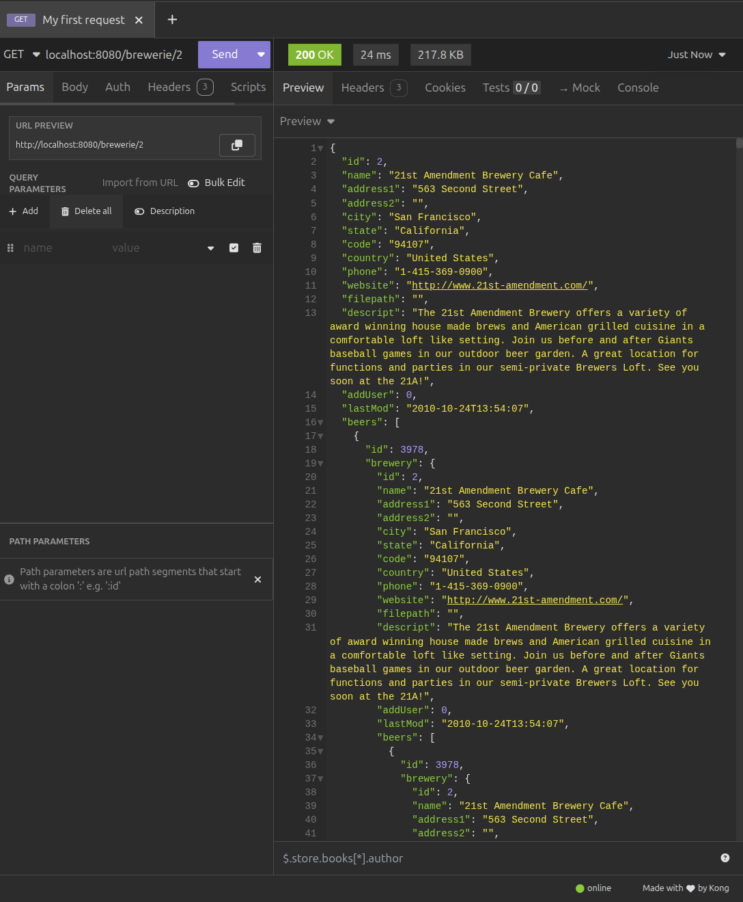

### CategoryController

**GET localhost:8080/categories**: Se obtienen todas las categorías
- Estado esperado: 200 (OK)
- Resultado: Array JSON con todas las categorías de la base de datos
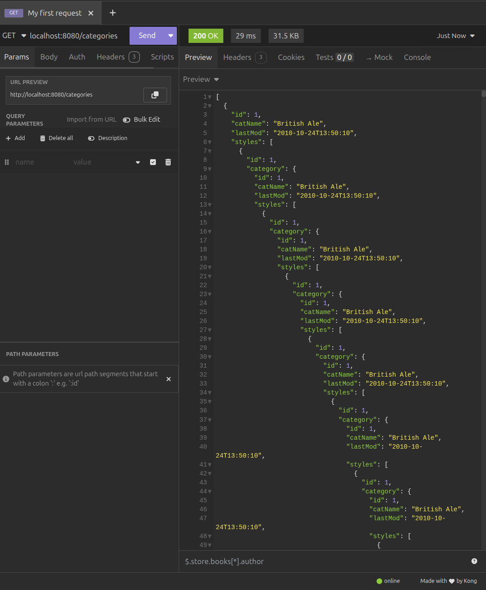

**GET localhost:8080/categorie/{id}**: Obtiene una categoría por su ID
- Estado esperado: 200 (OK)
- Resultado: Objeto JSON con los datos de la categoría solicitada
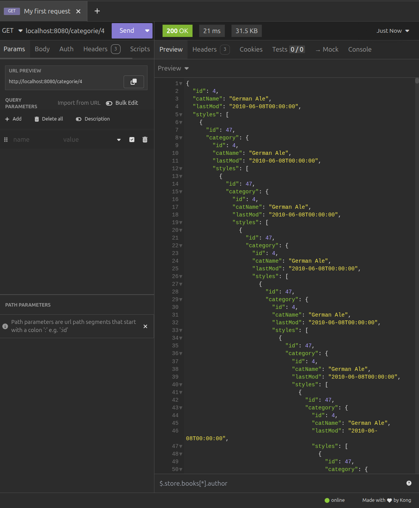

### StyleController

**GET localhost:8080/styles**: Se obtienen todos los estilos
- Estado esperado: 200 (OK)
- Resultado: Array JSON con todos los estilos de la base de datos
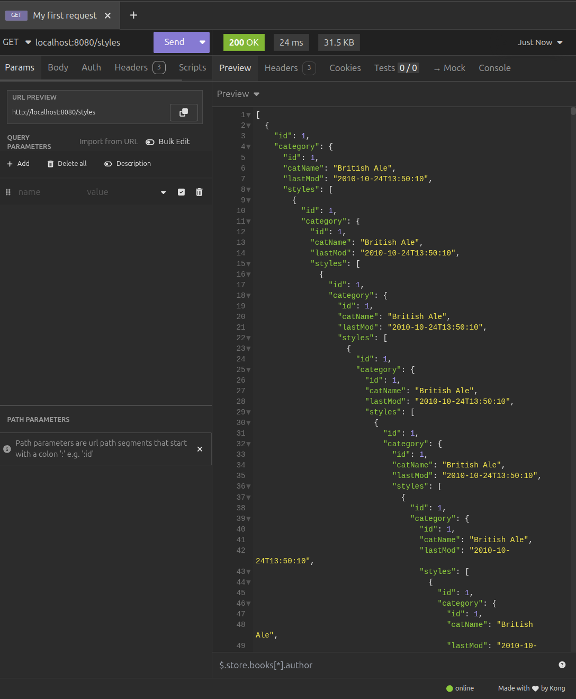

**GET localhost:8080/style/{id}**: Obtiene un estilo por su ID
- Estado esperado: 200 (OK)
- Resultado: Objeto JSON con los datos del estilo solicitado
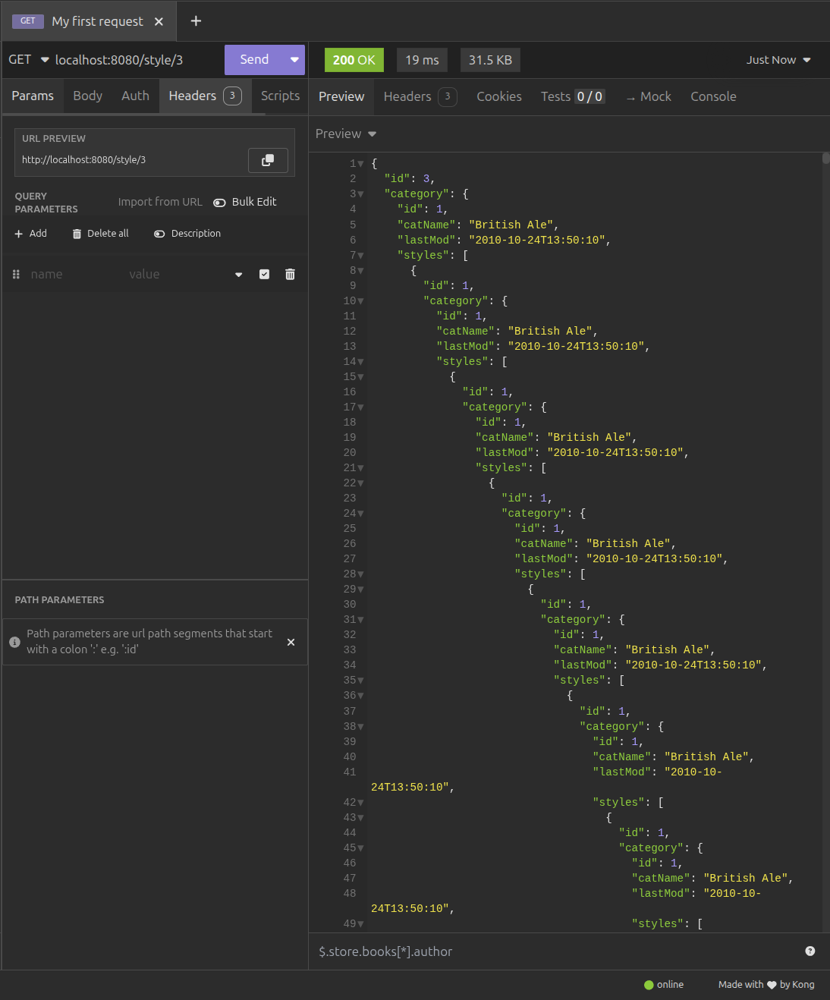
